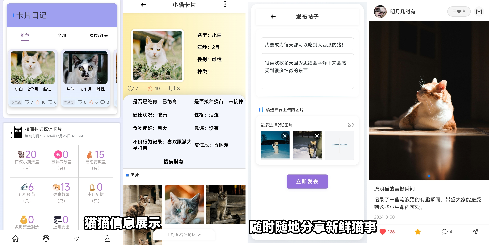
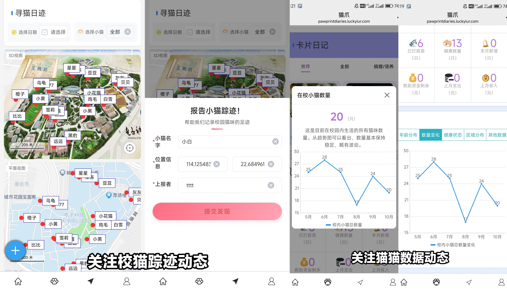
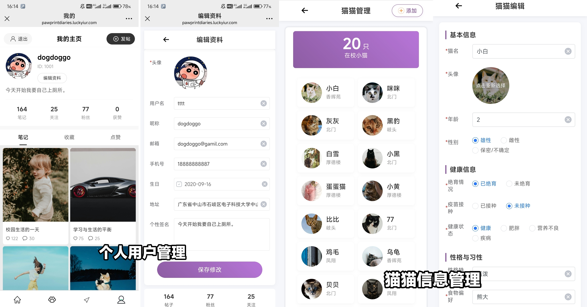
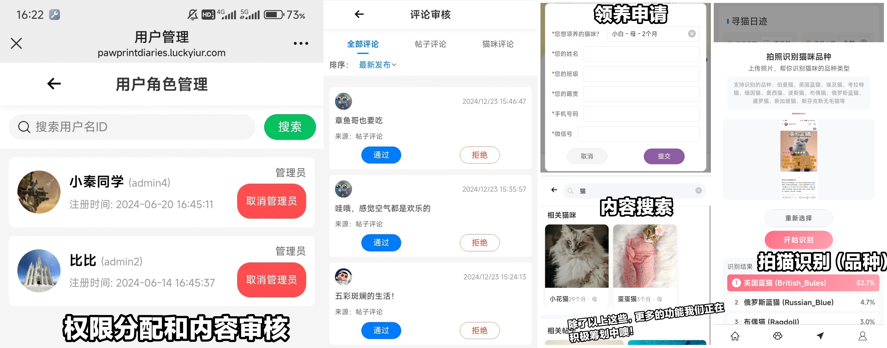

# 校猫日记 PawprintDiaries Spring Boot 服务器端
校猫日记是一个基于 Spring Boot 开发的校园猫咪管理平台。一个结合校园流浪猫救助管理和社交分享的社区平台，通过记录和分享学校流浪猫的信息，连接爱猫人士，共同为猫猫创造更好的生活环境，帮助校园内的猫咪志愿者更好地管理和关爱流浪猫，为救助工作提供信息支持，为学校管理提供数据参考。

目前校园流浪猫信息展示与交流平台原定功能任务实现（完成度约90%）基本完成。并且在服务器上完成测试部署，正处于已有功能测试和附加功能实现阶段。

H5前端代码也已开源，地址：https://github.com/vikis77/PawprintDiaries-H5

同时，欢迎大家来我的个人博客学习交流：https://luckyiur.com

### 体验入口地址：https://pawprintdiaries.luckyiur.com

### 技术栈：Spring Boot / MySQL / MyBatisPlus / Redis / RabbitMQ / Elasticsearch / Uniapp

### 部分技术实现细节：
- Spring Security 中设置过滤器链，结合 JSON Web Token (JWT) 实现用户认证，使用 BCrypt 加密算法处理密码。
- 基于 RBAC 模型思想，通过自定义注解和请求拦截器进行用户鉴权，实现内容审核、权限分配及内容管理功能。
- 设计三级缓存机制处理热点数据，配合缓存预热优化数据读取速度，并采用增加随机过期时间处理Key。
- 集成 Elasticsearch 提供全文搜索功能，显著提升用户在猫咪信息和帖子中的检索体验。
- 使用少量数据集训练 MobileNetV3_small 得到轻量化预测模型，结合 Flask API 提供图像识别服务（识别准确率85%）。
- 基于高德地图 JS SDK API 实现自定义校园猫咪轨迹地图，并通过 WebSocket 向订阅用户异步发送更新提示，以获取最新的猫咪动态与轨迹信息。
- 通过 AOP 切面提取请求信息及用户信息进行方法鉴权（匹配方法权限与用户所拥有的权限）。
- 配置全局限流过滤器（针对IP、接口），实现多层限流防护：
    1. 单IP限流：每秒最多x次请求
    2. 全局限流：所有IP总请求数每秒不超过xxx次
    3. URI限流：单个URI每秒最多xx次请求
    4. IP黑名单：自动封禁异常IP
    5. URI黑名单：自动封禁异常URI
- 实现自定义的短链接用户帖子/猫猫分享模块，分享所复制的连接呈现短链接形式，配合重定向查询真实链接确保跳转正确地址。
- 应用 RBloomFilter 处理用户小猫点赞行为，防止用户短时间连续点赞。
- 使用权重随机推送帖子（目前使用）：
    计算帖子权重分数：权重 = 点赞数 * 0.4 + 收藏数 * 0.3 + 评论数 * 0.2 + 浏览量 * 0.1
    按权重排序后随机扰动：最终分数 = 权重 * (0.8 + Random.nextDouble() * 0.4)
    除此之外，时间衰减权重方式和协同过滤推荐这两种推荐方式，代码中也提供了实现思路。

- 待完善：
    1. ARG问答知识库数据同步。
    
### 其他说明：
    1、识别模型代码暂未公开，但不影响其他功能运行。
    2、只使用 MySQL 的搜索也能正常使用搜索功能。如果需要使用 ES ，取消 ES 相关注释，并修改配置类，配上自己的配置项。
    3、如果有需要，数据库表结构后续将会公开处理。

实际页面效果如下（图片更新于2024/12，最新版已对部分页面重新优化）

